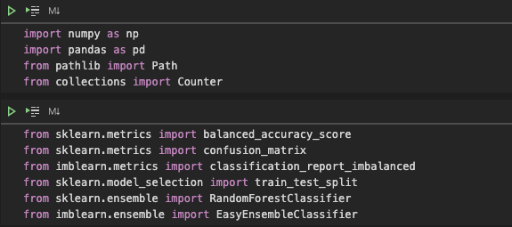
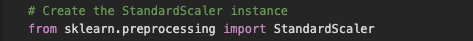
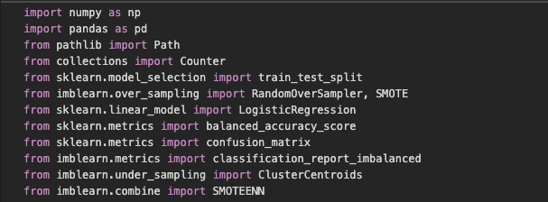
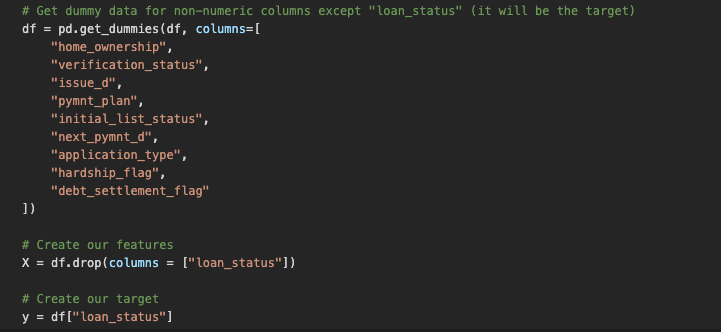
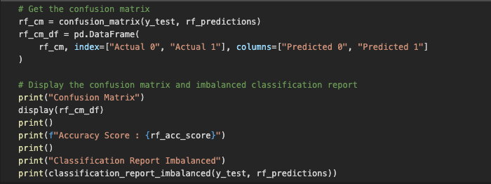
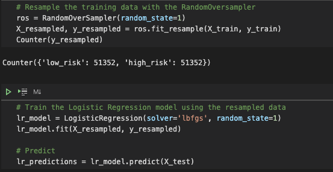
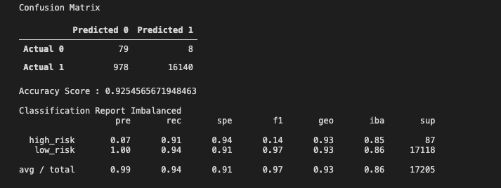

[source - https://collider.com/risky-business-tom-cruise-the-loser/]

# Risky_Business

Use machine learning techniques to predict credit risk.

---

## Overview

In this project we applied Resampling and Ensemble machine learning training models to predict credit risk of a borrower.

---

## Installation

Need everything in the following screenshot

---

## Code Screenshots

---

## Confusion Matrix Example

---

## Contributors

- Asif Meghani

Looking to contribute?
Contact me!

---

## Acknowledgements

Starter code and housing data has been provided by Rice University Trilogy Education Services

---

## Contact Me

linkedin - www.linkedin.com/in/asif-meghani-26a2a719

---

## License

MIT License

---